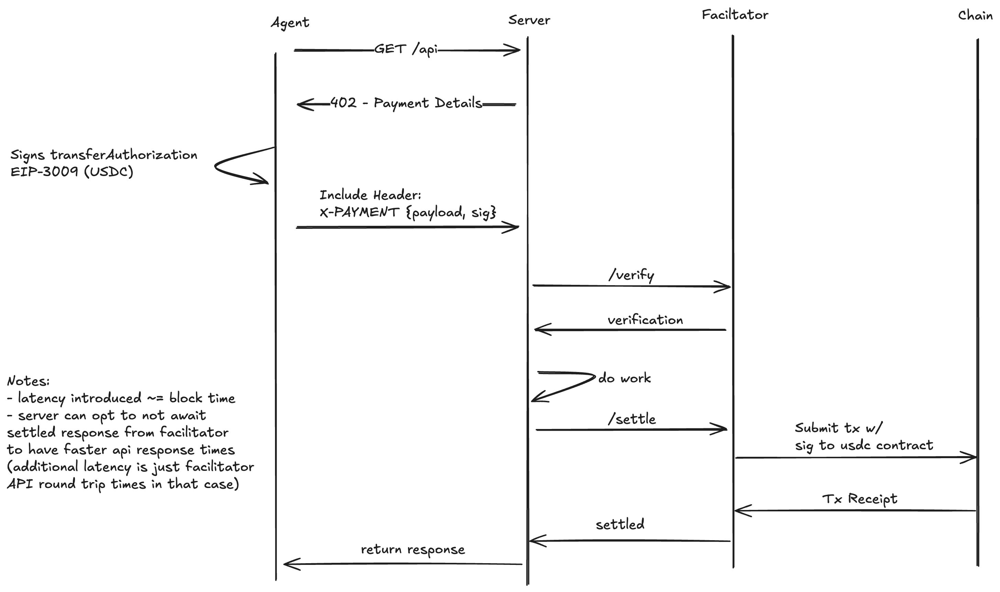

# x402 payments protocol

> "1 line of code to accept digital dollars. No fee, 2 second settlement, $0.05 minimum payment."

```typescript
app.use(
  "/your-api",
  // How much you want to charge, and where you want the funds to land
  paymentMiddleware("$0.10", "0x209693Bc6afc0C5328bA36FaF03C514EF312287C")
);
// Thats it! See example/resource.ts for a complete example. Instruction below for running on base-sepolia.
```

## Terms:

- resource: some thing on the internet, could be a file, a service, api, etc.
- client: entity wanting to pay for a resource
- facilitator service: service that facilitates verification and execution of payments onchain
- resource server: an http server that provides an api or other resources for a client

## Goals:

- permissionless and secure for clients and servers
- gassless for client and resource servers
- minimal integration for the resource server and client (1 line for server, 1 function for client)
- ability to trade off speed of response for guarantee of payment

## V1 Protocol



1. Make http request to resource server
2. Receive 402 response with json body `PaymentNeededDetails`

```
{
  x402Version: int,                       // Version of the x402 payment protocol
  accepts: [paymentDetails]               // List of payment details that the resource server accepts. A resource server may accept on multiple chains.
}

// paymentDetails
{
  scheme: string;                         // Scheme of the payment protocol to use
  maxAmountRequired: uint256 as string;   // Maximum amount required to pay for the resource as a usdc dollars x 10**6
  resource: string;                       // URL of resource to pay for
  description: string;                    // Description of the resource
  mimeType: string;                       // MIME type of the resource response
  outputSchema?: object | null;           // Output schema of the resource response
  resourceAddress: string;                // Address of the routing account that facilitates payment
  recommendedDeadlineSeconds: number;     // Time in seconds for the resource to be processed
  networkId: string;                      // the network of the blockchain to send payment on ex: `evm:8453`, `svm:Mainnet Beta`
  extra: object | null;                    // Extra information about the payment details specific to the scheme
};
```

3. Client selects one of the payment details returned by the `accepts` field of the server response creates payment payload to include as `X-PAYMENT` header based on the `scheme`
   The `X-PAYMENT` header is a base64 encoded json object with the following fields

```
{
  x402Version: number;
  payload: <scheme dependent>;
  resource: string;
}
```

Each payment scheme may have different operational functionality depending on what actions are necessary.
For example `exact`, the first scheme shipping as part of the protocol, would have different behavior than `upto`. `exact` transfers a specific amount (ex: pay $1 to read an article) while `upto` transfers up to an amount based on the resources consumed during a request (ex: generating tokens from an LLM).

The client must know what data different schemes need in the `X-PAYMENT` header. This is because clients must to some degree trust the scheme and the resource server.
High quality implementations of clients ensure security for clients by not allow malicious servers to dictate any logic on payload construction.

Example using `evm-exact`

3.c Convert `PaymentPayloadV1` to json and base64 encode

4. Send request to resource server with `X-PAYMENT` header

5. Resource server verifies payload its self or forwards payment header to facilitator service calling `verify`

### Verification (default path, synchronous)

Facilitator service (CDP provided) has the follow interface provided over REST. This is stubbed out in typescript but can be implemented in any language. `PaymentHeader` is the base64 encoded `PaymentPayloadV1`

```typescript
export type PaymentExecutionResponse = {
  success: boolean;
  error?: string | undefined;
  txHash?: Hex | undefined;
  chainId?: number | undefined;
};

export type ValidPaymentResponse = {
  isValid: boolean;
  invalidReason?: string | undefined;
};

interface FacilitatorService {
  verify(
    paymentHeader: string,
    paymentDetails: PaymentNeededDetails
  ): ValidPaymentResponse;
  settle(
    paymentHeader: string,
    paymentDetails: PaymentNeededDetails
  ): PaymentExecutionResponse; // amount is the required payment represented as a string
}
```

6. Verifier confirms funds are available and performs other checks to ensure the resource should accept the request

7. Resource server performs work to fulfill request

8. Resource server calls `settle` on the facilitator service

8.a facilitator service broadcasts the transaction to the usdc contract using `transferWithAuthorization` to settle the payment and waits for the tx to be confirmed

9. Facilitator service returns the `PaymentExecutionResponse` to the resource server

10. Resource server returns the response to the client

### Verification (optimistic aka just trust me bro)

todo: more detailed steps

- similar to default path but the resource server doesn't wait for payment to execute before returning the response to the client

### Verification (high value)

todo: more detailed steps

- on `verifyPayment` the resource server pulls funds into an escrow account before telling the client to proceed with the work.

## Future

- re-requesting resources that have been paid for

# Dev

#### Notes

- there is a window of time while the resource server is performing the work that the client could revoke a nonce or move funds that would result in the payment failing
- the resource server currently waits for payment to execute before returning the response to the client, meaning the minimum response time is 1 block

## Running example

1. create `.env` cp `.env.example .env` and follow instruction in the file to create wallets

2. `npm install` to install dependencies

3. in 3 separate terminals, run `npm run example-facilitator`, `npm run example-resource`, then finally `npm run example-client`. You should see things happen across all 3 terminals, and get a joke at the end in the client terminal.

## Running tests

1. `npm install` to install dependencies
2. Create `.env` with funded keys as above
3. `npm run test` to run tests

## TODO

- more tests
- fix wallet typing issues
- have tests run on an anvil fork
